<!-- Generated by `qits database diagram` (jpa). Do not edit: the entity-diagram automation rewrites this file on every release request fold. -->
# Persistence unit `idp`

Datasource `idp` · package `eu.wohlben.qits.idp.entity` · 13 entities

```mermaid
erDiagram
  %% idp_adoption: eu.wohlben.qits.idp.entity.IdpAdoption (idp)
  idp_adoption {
    short id PK "not null"
    instant adopted_at "not null"
    instant legacy_adopted_at
  }
  %% idp_authorization_code: eu.wohlben.qits.idp.entity.IdpAuthorizationCode (idp)
  idp_authorization_code {
    uuid id PK "not null"
    string client_id "not null, length 255"
    string code_challenge "not null, length 128"
    string code_hash UK "not null, length 255"
    instant consumed_at
    instant created_at "not null"
    instant expires_at "not null"
    string redirect_uri "not null, length 2048"
    uuid user_id "not null"
  }
  %% idp_client: eu.wohlben.qits.idp.entity.IdpDynamicClient (idp)
  idp_client {
    string client_id PK "not null, length 128"
    string claims "length 1024"
    string context_id "not null, length 256"
    string context_kind "not null, length 32"
    instant created_at "not null"
    text git_refs
    string owner "not null, length 128"
    string secret_hash "not null, length 255"
  }
  %% idp_register_token: eu.wohlben.qits.idp.entity.IdpRegisterToken (idp)
  idp_register_token {
    uuid id PK "not null"
    instant consumed_at
    instant created_at "not null"
    uuid created_user_id
    string minted_by "not null, length 128"
    string token_hash UK "not null, length 255"
  }
  %% idp_seed: eu.wohlben.qits.idp.entity.IdpServiceClientSeed (idp)
  idp_seed {
    short id PK "not null"
    string client_id "not null, length 128"
    instant seeded_at "not null"
  }
  %% idp_service_client: eu.wohlben.qits.idp.entity.IdpServiceClient (idp)
  idp_service_client {
    string client_id PK "not null, length 128"
    instant created_at "not null"
    string created_by "not null, length 128"
    string legacy_secret_hash "length 255"
    string previous_secret_hash "length 255"
    instant previous_valid_until
    instant rotated_at
    string secret_hash "not null, length 255"
  }
  %% idp_session: eu.wohlben.qits.idp.entity.IdpSession (idp)
  idp_session {
    uuid id PK "not null"
    instant created_at "not null"
    instant expires_at "not null"
    instant revoked_at
    string token_hash UK "not null, length 255"
    uuid user_id "not null"
  }
  %% idp_signing_key: eu.wohlben.qits.idp.entity.IdpSigningKey (idp)
  idp_signing_key {
    string kid PK "not null, length 64"
    string algorithm "not null, length 16"
    instant created_at "not null"
    string private_key_pem "not null"
    string public_key_pem "not null"
    instant retired_at
    enum status "not null"
  }
  %% idp_token: eu.wohlben.qits.idp.entity.IdpToken (idp)
  idp_token {
    uuid id PK "not null"
    string claims "length 1024"
    string context_id "not null, length 256"
    string context_kind "not null, length 32"
    instant created_at "not null"
    text git_refs
    string owner "not null, length 128"
    string subject UK "not null, length 128"
    string token_hash UK "not null, length 255"
  }
  %% idp_user: eu.wohlben.qits.idp.entity.IdpUser (idp)
  idp_user {
    uuid id PK "not null"
    instant created_at "not null"
    string password_hash "length 255"
    string username UK "not null, length 128"
  }
  %% idp_user_role: eu.wohlben.qits.idp.entity.IdpUserRole (idp)
  idp_user_role {
    string role PK "not null, length 128"
    uuid user_id PK "not null"
    instant created_at "not null"
  }
  %% idp_webauthn_credential: eu.wohlben.qits.idp.entity.IdpWebAuthnCredential (idp)
  idp_webauthn_credential {
    string credential_id PK "not null, length 1364"
    uuid aaguid "not null"
    long counter "not null"
    instant created_at "not null"
    bytes public_key "not null"
    long public_key_algorithm "not null"
    uuid user_id "not null"
  }
  %% idp_workstation_refresh_token: eu.wohlben.qits.idp.entity.IdpWorkstationRefreshToken (idp)
  idp_workstation_refresh_token {
    uuid id PK "not null"
    string client_id "not null, length 255"
    instant created_at "not null"
    instant expires_at "not null"
    uuid family_id "not null"
    instant revoked_at
    string token_hash UK "not null, length 255"
    instant used_at
    uuid user_id "not null"
  }
```

